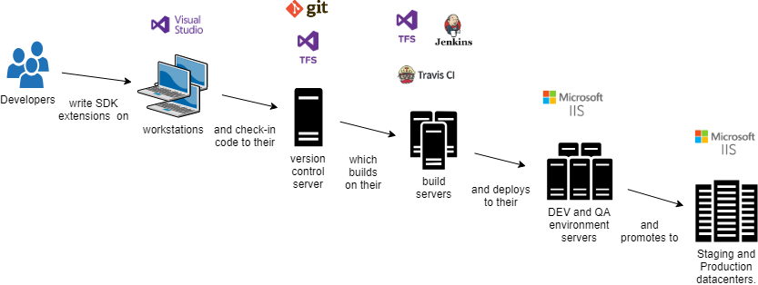

# DevOps

Handling continuous integration and delivery is the same general process as with a typical .NET application. There are multiple ways to handling building and deploying Znode.

## CI/CD Integration

A typical CI/CD pipeline, as could be implemented with [TFS](https://docs.microsoft.com/en-us/azure/devops/pipelines/overview?view=azure-devops-2019), [Jenkins](https://jenkins.io/), [Travis CI](https://travis-ci.org/), etc.

<a href="http://jgraph.github.io/drawio-github/edit-diagram.html?user=bsmith1310@gmail.com&org=amlacommerce&repo=znode-docs-test&path=docs/dev-ops/_assets/devops-ci.png" target="_blank">Edit</a>

A build and deploy pipeline like this is the most robust solution and recomended for large projects, projects with multiple members, or even smaller projects if the infrastructure exists and can be easily maintained.

## Web Publish to Remote IIS

A less robust, but much simpler way to push code changes to remote environments is by using Visual Studio's Remote Deploy to IIS feature. See Microsoft's [official documentation](https://docs.microsoft.com/en-us/aspnet/web-forms/overview/deployment/visual-studio-web-deployment/deploying-to-iis) for more information.