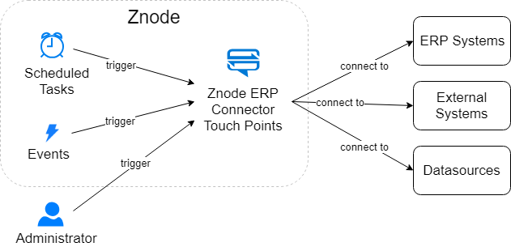

# ERP Connectors

In Znode, ERP Connectors allow integrations with ERP systems, datasources, and external systems of any type.

An ERP Connector is implemented as a C# class. Class methods are referred to as ERP Connector 'touch points'.

This diagram shows how touch points can be triggered automatically on a schedule, in reponse to an event, or invoked manually from the Admin UI.

<a href="http://jgraph.github.io/drawio-github/edit-diagram.html?user=bsmith1310@gmail.com&org=amlacommerce&repo=znode-docs-test&path=docs\extending-znode\custom-extensions\erp-connectors\_assets\erp-connector.png" target="_blank">Edit</a>

## Touch Points

Touch points are the most important part of the ERP Connector. As mentioned, touch points are simply just C# methods that can be written to do anything as needed. 

Touch points are most commonly used for:

* Integrating with external systems
  * Ex: Exporting data to external systems
  * Ex: Importing data from external systems
* Performing maintenance tasks
  * Ex: Running a task every hour that checks for an updated product feed file
  * Ex: Running a task every minute to ping an external system as part of a health check
  * Ex: Running a task on demand (when manually invoked by an admin) to do other semi-automated maintentance

## Creating a Custom ERP Connector

The below instructions walk through the process of creating a custom ERP connector and touch point.

### Create ERP Connector

To create a custom ERP Connector, use the sample MockERPConnector as a starting point.

1. Copy the [MockERPConnector](https://github.com/amlacommerce/znode/tree/master/ZnodeMultifront/Projects/Libraries/Znode.Engine.ERPConnector/MockERPConnector) of the Znode.Engine.ERPConnector project as a starting point.
1. Rename the folder to the desired name.
1. Include the new connector it in the Visual Studio project.
1. Rename the .cs class files (and the class names).
1. Rename the config file and the occurances of the old name inside the config file.
1. Build the solution to make sure there are no errors.
1. If necessary, for the Znode.Engine.API project, add a reference to the Znode.Engine.ERPConnector project.
1. Run Znode from the Visual Studio solution.
1. Navigate to the Admin in a browser tab (http://localhost:6766 by default).
1. Under the `Dev Center` module, select the `Extension` engine. Click on extension engine drop-down for `ERP Connector`.
1. On the `ERP Connector` page, select  the new connector as the ERP Package.
1. Fill in details for the new ERP Connector, make sure the new ERP Package has its status set to “Activate”, and click `Save`.

### Create Touch Point

With the new ERP Connector enabled, it is time to create a touch point that will hold the custom logic.

1. In the new connector's [*Connector.cs](https://github.com/amlacommerce/znode/blob/master/ZnodeMultifront/Projects/Libraries/Znode.Engine.ERPConnector/MockERPConnector/ZnodeMockERPConnector.cs) file, add a public method with any desired logic.
1. Build and restart the application.
1. In the Admin UI, navigate to `Dev Center` > `<CustomERPConnector>` > `* TOUCH POINT LIST`.
1. Page will reload. No records are shown.
1. Click `Add New` to select a touch point to enable.
1. Click `Save`.
1. Click under `Actions` the middle-check box to enable the touch point. Touch point will confirm with green checkmark when enabled.
1. Click `Actions` > `Trigger` button. If breakpoints are enabled and Visual Studio is attached to the running processes, it should hit the breakpoint.
