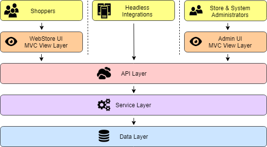

# Platform Introduction

Znode is a .NET platform composed of 3 separate ASP.NET web applications hosted by IIS.

## Technology Stack

All application code (excluding the UI) is written in C#.

### Frontend

The Znode frontend consists of two separate MVC applications, the [Admin UI](https://github.com/amlacommerce/znode/tree/master/ZnodeMultifront/Projects/Znode.Engine.Admin) and the [WebStore](https://github.com/amlacommerce/znode/tree/master/ZnodeMultifront/Projects/Znode.Engine.WebStore).

* ASP.NET C# MVC
* Razor view templates
* Primarily server-side rendered pages
* Ajax data interactions
* Acts as API Gateway

### Backend

The Znode backend is a single WebAPI application, known in the code, simply as the [API](https://github.com/amlacommerce/znode/tree/master/ZnodeMultifront/Projects/Znode.Engine.Api).

* ASP.NET C# WebApi
* API resources = Controller classes
* API endpoints = Controller methods
* Entity Framework for easy SQL DB CRUD
* Autofac for dependency injection

### Data

Znode persists data to 3 types of database systems, SQL Server, MongoDB, and Elasticsearch.

* SQL Server
  * Normalized system of record for everything
  * Contains source data to recreate MongoDB and Elasticsearch data
* MongoDB
  * Stores denormalized products and content for speed and scale
* Elasticsearch
  * Supports product search

## Deployment Architecture

This diagram shows what a typical Znode deployment looks like.

<a href="http://jgraph.github.io/drawio-github/edit-diagram.html?user=bsmith1310@gmail.com&org=amlacommerce&repo=znode-docs-test&path=docs/introduction/_assets/deployment-architecture.png" target="_blank">Edit</a>

## Logical Architecture

This diagram shows a different view of the system, emphasizing the strict layering of responsibilities.

<a href="http://jgraph.github.io/drawio-github/edit-diagram.html?user=bsmith1310@gmail.com&org=amlacommerce&repo=znode-docs-test&path=docs/introduction/_assets/logical-layers.png" target="_blank">Edit</a>
