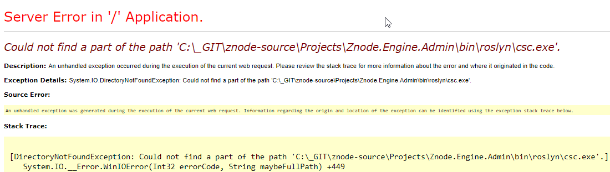
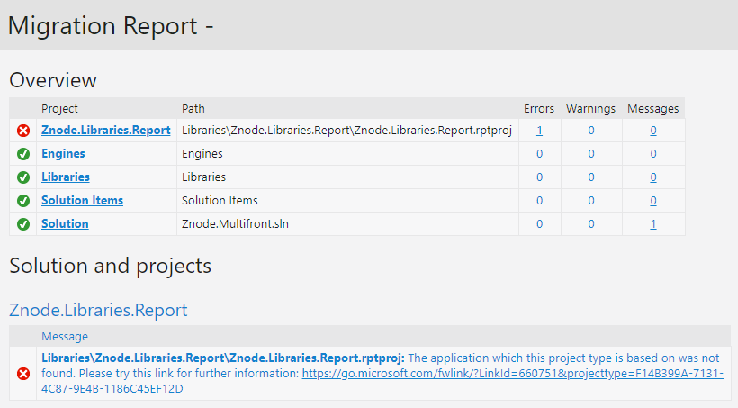
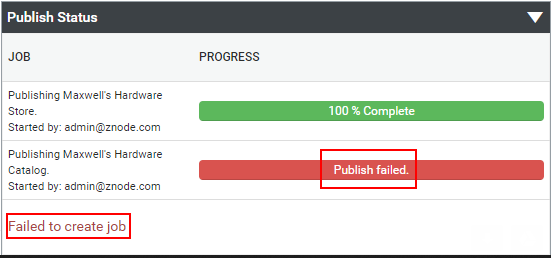
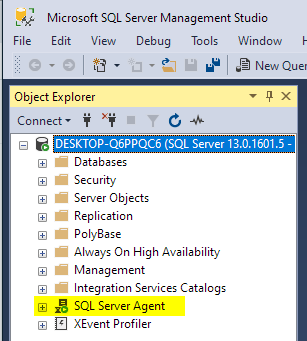
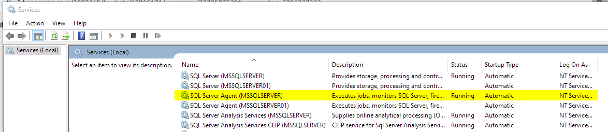
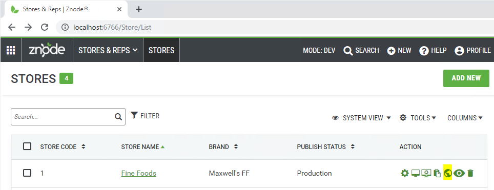
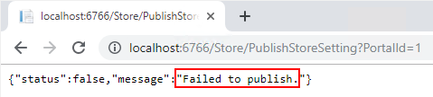
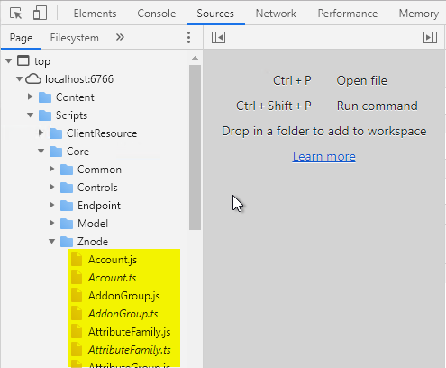

# Troubleshooting Common Problems

The page has information about some of the common problems that Znode developers run into.

## Roslyn 'csc.exe' Error

**Problem:** The Znode Admin UI / API / WebStore application(s) are failing to load, possibly (but not necessarily) giving the following error:



However, there may be no useful error presented. To check if this problem is the cause of one (or more) of the applications failing to load, check the `bin` folders of the applications. If any of the following folders are empty, the problem is occuring:

* Znode.Engine.Admin\bin\roslyn
* Znode.Engine.Api\bin\roslyn
* Znode.Engine.WebStore\bin\roslyn

**Possible Solutions:** This problem is very inconsistent among Znode developers, and seems to be [inconsistent among the .NET community in general](https://stackoverflow.com/questions/32780315/could-not-find-a-part-of-the-path-bin-roslyn-csc-exe).

* First, 'clean' the solution and then 'build' the solution again. Try runnning the app again to see if the problem is resolved.
* If the prior step fails to solve the problem, download [this copy](_assets/roslyn.zip) of the `roslyn` folder and place it in the application `bin` folders.

## Znode.Libraries.Report Project Failed to Load

**Problem:** When opening the Znode solution with Visual Studio, a migration report with an error is presented.



**Solution:** Install [SSRS](https://docs.microsoft.com/en-us/sql/reporting-services/create-deploy-and-manage-mobile-and-paginated-reports?view=sql-server-2017) if desired. Note that Znode currently has reports implemented in two different frameworks: (1) [SSRS](https://docs.microsoft.com/en-us/sql/reporting-services/create-deploy-and-manage-mobile-and-paginated-reports?view=sql-server-2017), and (2) [DevExpress](https://www.devexpress.com/). The DevExpress reports are replacing the SSRS reports, so SSRS reports are not critical to have functional. 

**Bottom line:** This error can be safely ignored if not interested in Znode's deprecated SSRS reports.

## TypeScript Compilation Errors

**Problem:** When opening the Znode solution with Visual Studio (likely 2019), complilation error(s) fail the build. Znode's internal developers still use Visual Studio 2017 and it has been noted that Visual Studio 2019's TS compiler is more strict in some places.

**Solution:** Add a `// @ts-ignore` comment on the line immediately above the line that is failing.

For example:

```
let value = 0;
// @ts-ignore
value = getMyValue(); // (this line is ignored by the compiler)
```

## Publish Fails with "Failed to create job"

**Problem:** When publishing the store, the publish fails with an error message saying "Failed to create job".



**Solution:** Make sure the SQL Server Agent is running.





## Miscellaneous Visual Studio Build Errors

**Problem:** Visual Studio is failing to build Znode, and there are no code changes that cause breakage.

**Possible Solutions:**

* Try building again. Sometimes this is enough to push through the failures.
* Try a full clean/rebuild.
* Try restarting Visual Studio.
* Try restarting the computer entirely (sometimes Visual Studio and/or MSBuild can leave behind corrupted processes that need to be restarted).

## TypeScript Compiler (TSC) Error

**Problem:** When building the Znode solution with Visual Studio, TypeScript errors occur. This problem sometimes occurs in the Admin UI and WebStore applications but is inconsistent.

**Possible Solutions:** Possible solutions include:

* Restart Visual Studio and/or Windows itself.
* Upgrade the version of TypeScript used in the Admin UI and WebStore projects.
  * For the `Znode.Engine.Admin` and `Znode.Engine.WebStore` projects, in Visual Studio, right click on the project, go to `Properties` > `TypeScript Build` tab, then in the `TypeScript version` field choose a later (or latest) version. Try building again, possibly restarting Visual Studio and/or Windows if necessary.

## Failed to Publish Error

**Problem:** The Znode Admin UI's Store publish functionality is failing.

When clicking the publish button for a store:



The following error results:



**Possible Solution:** This problem usually indicates that scripts are not properly loading in the Admin UI.

To determine if this is happening:

1. Open the browser's developer tools while on the `Stores & Reps` > `Stores` screen (http://localhost:6766/Store/List#).
1. Navigate to the `Scripts` > `Core` > `Znode` directory. A list of scripts should be loaded:



If the scripts shown on the local environment is non-existent or very short (just a couple scripts), as opposed to having several dozen scripts as expected, then this most likely means that Visual Studio is not properly building the scripts. Locally, these scripts appear in the `/Projects/Znode.Engine.Admin/Scripts/Core/Znode` directory. Here, each *.ts file should have a corresponding *.js file.

To fix this, make sure that the [Web Compiler](https://marketplace.visualstudio.com/items?itemName=MadsKristensen.WebCompiler) is properly installed and configured as described in the [Installing Znode](/docs/quickstart-guide/installing-znode/README.md) document.
